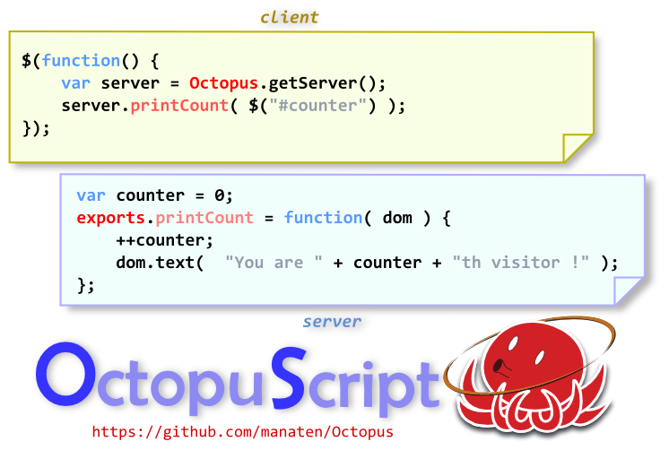

# Octopus

Octopus is distributed JavaScript language which makes easier web application developing.
With Octopus, you can write program in JavaScript for both browser and server
and in these program, JavaScript objects are able to refer in one from another.

## How to Install

Octopus requires node.js, Java and Ruby.
Octopus uses socket.io node.js library.
Octopus works on Cygwin, Linux and MacOS.

## How to use

To invoke sample chat, type

./octopus sample/chat

